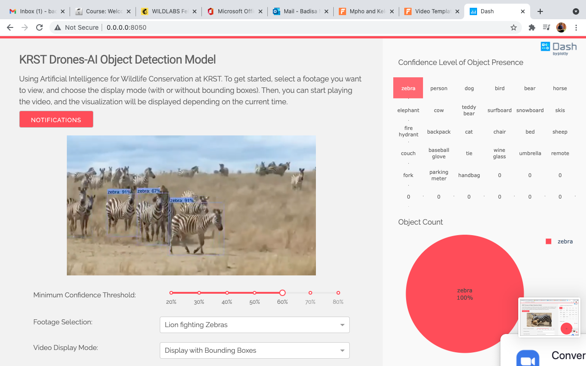

# Augmenting wildlife conservation efforts using Tensorflow Object Detection API
KRST flagship project done under the UIG co-creation platform.
Drones as a great data collection tool, coupled with Machine Learning techniques will augment our ability to study, manage and protect wildlife ecosystems and aid in combating a plethora
of wildlife conservation challenges. 

This work was done with the guide and help from Plotly Dash https://github.com/plotly and Tensorflow Object Detection API https://tensorflow-object-detection-api-tutorial.readthedocs.io/en/latest/

## Object Detection using Neural Network and Plotly Dash

The goal is to use an Object detection API to identify the animal in the drone video stream.
Classify species of animals based on images coming from drone streams. Automatically help identify animals in the wild taken by wildlife conservatories. The dashboard where the objects of interest are detected is shown below.

## Installation and Usage

First, install all dependencies listed in requirements.txt

* Clone the repo and cd into the krst_objectDetection directory

* $ pip install -r requirements.txt

Run app.py script to launch a local Dash server to host the Dash app. 

* python app.py

* A link will appear in your console; Navigate to http://0.0.0.0:8050 on a browser tab to see the results.

## Method

Train images of animals from six different species with thousands of labeled pictures using Convulational Neural Network. Data came from Animals-10 dataset in kaggle. Only chose six of the available species due to computer processing limitations, as well as fixed time window to run experiment.
All process and methods can be found in the Final Notebook

## Conclusion

This model can excellently guess a picture of an animal if the shape of the animal is in the training method. However, the model does not seem to do well on aerial videos or images. To train it in additional animals, simply feed it labeled images (1000 at least for training and 300+ for validation). 

## Issues
* improve Detection  accurary
* train on more aerial data
* deploy application live

## Licensing**
[Apache 2.0](https://www.apache.org/licenses/LICENSE-2.0)

## Authors
Badisa Mosesane 

## Contributing** 
We thank the work done by Plotly Dash https://github.com/plotly and referenced most of the work here.
Send us a PR at https://github.com/BadisaMosesane/krst_objectDetection

